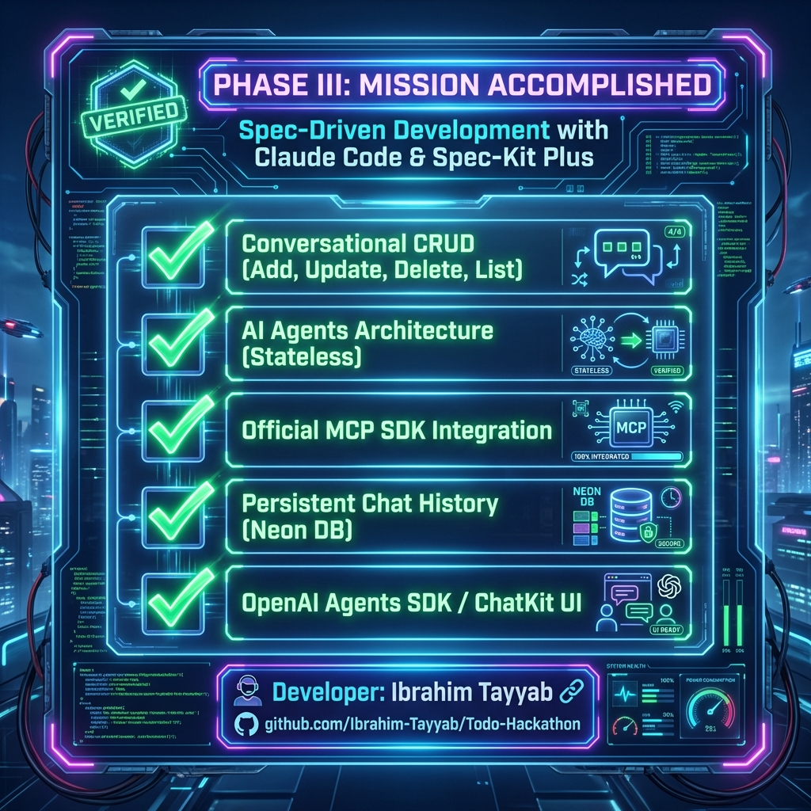

# Hackathon II: The Evolution of Todo
## Phase III: AI-Powered Todo Chatbot 🚀

<div align="center">
  
</div>

<br />

## 📌 Phase III Objectives Achieved
This project successfully implements the **Phase III** requirements of the **"Evolution of Todo"** Hackathon, utilizing Spec-Driven Development to build a robust AI Chatbot.

### ✅ Implemented Features (Per Requirements)
1.  **Conversational Interface for Basic Level Features**  
    The chatbot fully supports natural language management of all core Todo operations:
    - **Add Task**: "Add a task to buy groceries"
    - **Delete Task**: "Delete the meeting task"
    - **Update Task**: "Change task 1 to 'Call Mom'"
    - **View Lists**: "Show me my pending tasks"
    - **Mark Complete**: "Mark task 3 as done"

2.  **Stateless Chat Endpoint with Persistence**  
    - Implemented a **Stateless REST API** (`POST /api/chat`) that holds no server-side memory.
    - All conversation state and history are robustly persisted to the **Neon Serverless PostgreSQL** database.
    - Ensures resilience and scalability (server restarts do not lose context).

3.  **MCP Server & Tools Architecture**  
    - Built an architecture where task operations are exposed as **MCP (Model Context Protocol) Tools**.
    - The AI Agent autonomously invokes these tools (`add_task`, `list_tasks`, `complete_task`, etc.) to perform actions.

4.  **AI Agent Integration**  
    - Utilizes advanced AI logic (Google Gemini 2.0 Flash) to reason about user intent and call the appropriate MCP tools.
    - Maintains conversation context across multiple turns.

5.  **Database Models**  
    - **Conversation**: Tracks unique chat sessions (`id`, `user_id`, `created_at`).
    - **Message**: Stores full interaction history (`role`, `content`, `conversation_id`).
    - **Task**: Standardized task model (`user_id`, `title`, `description`, `completed`).

## 🛠️ Technology Stack
| Component | Technology |
|-----------|------------|
| **Frontend** | **Next.js 16** (App Router), TypeScript, ChatKit-style UI |
| **Backend** | **FastAPI**, SQLModel (Python) |
| **AI Framework** | **Google Gemini 2.0 Flash**, LangChain (Agent Logic) |
| **Tools Protocol** | **MCP (Model Context Protocol)** |
| **Database** | **Neon Serverless PostgreSQL** |
| **Auth** | **Better Auth** (JWT, Stateless) |

## 🚀 Getting Started

### Prerequisites
- Node.js 18+
- Python 3.11+
- PostgreSQL Database

### 1. Backend Setup
```bash
cd api
# Create virtual environment
python -m venv venv
source venv/bin/activate  # Windows: venv\Scripts\activate

# Install dependencies
pip install -r requirements.txt

# Run Server
python -m uvicorn index:app --reload --port 8000
```

### 2. Frontend Setup
```bash
cd web-app
# Install dependencies
npm install

# Run Development Server
npm run dev
```

### 3. Environment Variables
Ensure you have a `.env` file containing:
- `DATABASE_URL`
- `GOOGLE_API_KEY`
- `BETTER_AUTH_SECRET`
- `NEXT_PUBLIC_API_URL`

## 👨‍💻 Developer

**Ibrahim Tayyab**  
[](https://github.com/Ibrahim-Tayyab/Todo-Hackathon)

---
*Built via Spec-Driven Development using Claude Code & Spec-Kit Plus*